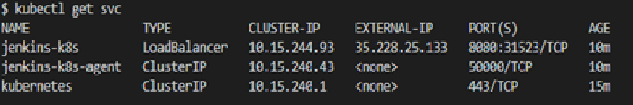
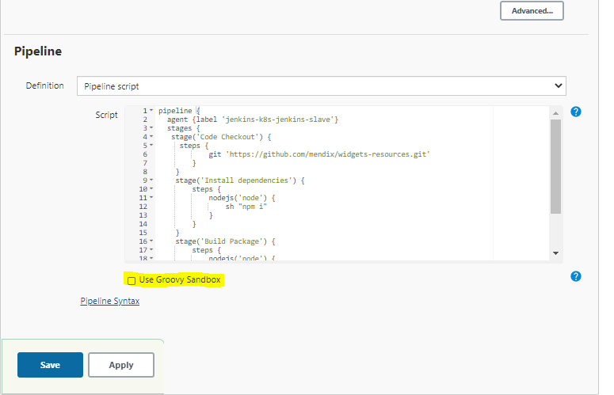

# Automated kubernetes cluster setup and Jenkins Deployment 
The objective of this project is to use terraform in order to achieve an 
automated deployment of kubernetes cluster on google cloud and also to deploy Jenkins helm charts on the same cluster. 

## Tools and Technologies

- **Terraform** : Used to setup k8s on google cloud
- **Helm Charts** : Used to define templates and instructions to deploy Jenkins on k8s 
- **Git** : used to manage source code on github
- **kubectl** : used as a CLI to interact with the k8s cluster


## Objectives

- set up kubernetes cluster on google cloud(2 node kubernetes cluster)
- Jenkinks Master and worker configuration deployed on the GKE cluster using offical docker images for jenkins
- Configure a CI/CD Jenkins pipeline
- Install a helm chart(containing jenkins configuration) on the kubernetes cluster using terraform 
- Dynamic scaling of the jenkins workers on demand

## Helm Charts 
- In this project, I have used the stable jenkins helm chart from the official [repo](https://github.com/helm/charts/tree/master/stable/jenkins)

- This chart refers to the official Jenkins [image](https://hub.docker.com/r/jenkins/jenkins/)

- I have used the stable jenkins in the project for two reasons:
    > The chart comes with jcasc plugin installed so no additional step was needed to configure this.

    > For making the project simple and adhere to the timelines.


## [jcasc](https://github.com/jenkinsci/configuration-as-code-plugin) configuration for jenkins
- The jenkins configuration for jenkins slave, kubernetes and pod template and job has been define in the value.yaml file place under jenkins-k8s-jcasc/terraform/jenkins/.

> Note: you can search the text JCasC configuration in the values yaml to view the configuration done.

- The configuration is generated as config map as part of the project

- Using this approach no manual work is needed to configure the jobs or the pods templates.

- Node image has been referred has part of the jenkins slave configuration as it is need to build the package

## Prerequisites to run the project 
-   **GCP account**: If you don’t have a GCP account, [create one now](https://console.cloud.google.com/freetrial/). This tutorial can be
    completed using only the services included in [GCP  Free Tier](https://cloud.google.com/free/).
    > Note: Kindly select "onwer role" for the sevice account as this will be required to create VPC, Subnets, k8s cluster. I have used owner role for the purpose of simplicity in this assesment.

-   **GCP project**: GCP organizes resources into projects. You can [create one](https://console.cloud.google.com/projectcreate) in the GCP Console.
    You need the project ID later in this tutorial.

-   **GCP service account key**: Terraform will access your GCP account by using a service account key. You
    can [create one](https://console.cloud.google.com/apis/credentials/serviceaccountkey) in the GCP Console. While creating the key, assign the role as **Project > Editor**.

>   Note : Afer creating the GCP service account key, download the service account key in json format and   place it in the Jenkins-k8s-jcasc/terraform directory of the project and rename the file as **account.json** This file containes the credentials for terraform to create resources in Google cloud.

-   **Google Kubernetes Engine API**: You can enable the Google Kubernetes Engine API for your project in
    the [GCP Console](https://console.developers.google.com/apis/api/container.googleapis.com).

-   **Google Compute Engine API**: You can enable the Google Kubernetes Engine API for your project in
    the [GCP Console](https://console.developers.google.com/apis/api/compute.googleapis.com).

-   **Terraform**: You can install Terraform with [these instructions](https://learn.hashicorp.com/terraform/gcp/install).

-   **Kubectl**: [Install Kubectl on your local machine to interact with the GKE](https://kubernetes.io/docs/tasks/tools/install-kubectl/)


## How to run the project ?
Please follow the steps below to setup jenkins master worker configuration on Kubernetes cluster:

### Make changes to values.tfvars
- Update the project_id to the project id mentioned in account.json file placed under Jenkins-k8s-jcasc/terraform.

### Terraform commands
```
$ cd Jenkins-k8s-jcasc/terraform
```
```
$ terraform init
```
> I have created a shell script to supply arguments to the normal terraform commands. See below -
```
#!/bin/bash

export PROJECT_ID=jenkins-test-project
export GOOGLE_APPLICATION_CREDENTIALS="$PWD/account.json"
terraform $1 -var-file=$2 $3
if [ "$1" = "apply" ] ; then
   export KUBECONFIG="$(terraform output kubeconfig_path)"
fi


```
```
# The terraform plan command is used to create an execution plan. Run below command - 
 
$ sh terraform.sh plan values.tfvars 
```


```
$ sh terraform.sh apply values.tfvars --auto-approve 
#used to create an execution plan for the resources such as kubernetes cluster, helm charts on google cloud.
```

### Check K8S resources

* You can check k8s resource on google kubernetes engine dashboard - refer [here](https://cloud.google.com/kubernetes-engine/docs/concepts/dashboards) for more details.
* Also , if you have kubectl installed on your local then you can connect to gke k8s cluster which you have created and use kubectl commands to view pods,services,nodes,namespaces,pvc,secrets . Refer [here](https://kubernetes.io/docs/reference/generated/kubectl/kubectl-commands) for kubectl commands.

### Verify Jenkins deployment

The above deployment installed the Jenkins in the cluster. The verification of the deployment can be done in two ways:

### option 1: Using Below Commands:
```
$ export KUBECONFIG="$(terraform output kubeconfig_path)"
```
> Note: This command is used export the kubeconfig file that is generated dynamically upon cluster creation. Exporting KUBECONFIG is necessary for the kubectl commands to connect with the cluster.

if running the setup on windows os, use SET KUBECONFIG="./kubeconfig"
```
$ kubectl get po
```
 
```
$ kubectl get svc
```

```
$ kubectl get nodes 
```


### option 2: Logging directly into google cloud account;

check GKE dashboard to verify deployment
- Login to your google cloud account and select you project.

> 

- Check service and ingress. Here you also find the jenkins url to access the console.
> Note: I have created and destroyed the cluster several time hence the ip address is different in the below screenshot 
> 

- Check clusters.

> 

- Check workloads.

> 


#### Access Jenkins

Jenkins server is deployed in the cluster and can be accessed by copying the External-IP of service **jenkins-k8s** and pasting into the browser. In the Login page, enter admin in username and password.

Jenkins page will come with Login button !!!


**username: admin**

**password: In order to get the password, run the below command.**
```
kubectl get secret --namespace default jenkins-k8s -o jsonpath="{.data.jenkins-admin-password}" | base64 --decode
```


### Running the Job

- Once you are able to login into the jenkins console you will see a job already created.


- The job is preconfigured using jcasc and points to the github project for mendix widget.

- The last step is just to build the Job and this activity might take upto 20 mins.


- If you run into any permission issue to approve the build for the pipeline script, kindly follow the below step
  
  > Go to Configure and scroll down to pipeline script
  
  > Enable the groovy sandbox checkbox.
  
  > Save configuration and theb Build the job.

  


  ### Shutting down the cluster

  - Once the job has been built you can destroy the cluster using the below command:
  
  ```
  sh terraform.sh destroy values.tfvars --auto-approve
  # will delete all resouces created using terraform as part of this assessment.
  ```


